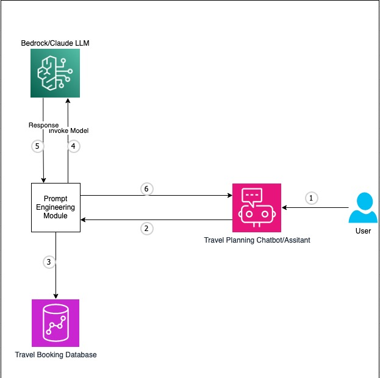
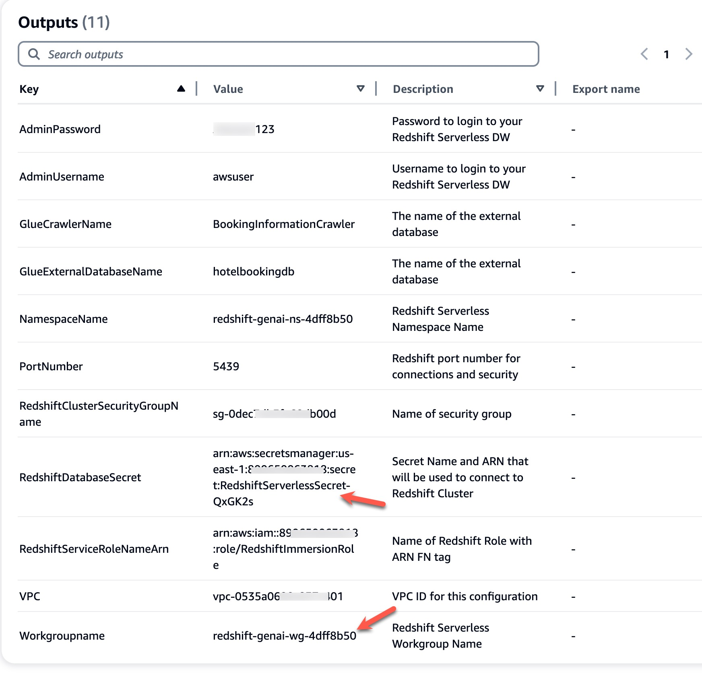
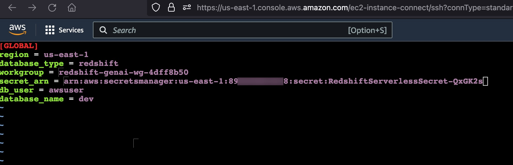

# personalized-travel-itinerary-planner


This solution contains two major components. At first, we will extract the user’s information like Name, location, hobbies, interests and Favourite food etc along with their upcoming travel booking details. With this information we will stitch a user prompt together and pass it to Amazon Bedrock/Anthropic Claude LLM to obtain a personalized travel itinerary that the Customers can use. Below architecture diagram provides us a high level overview of the workflow and the components involved in this architecture. 



We will obtain the user ID from the chatbot interface, which will be sent to the Prompt engineering module. User’s information like Name, Location, hobbies, interests and favorite food is extracted from the Redshift database along with their upcoming travel booking details like travel city, check In and check out dates. 

## Deploy this solution

Step 1: Ensure the account and the region where the solution is being deployed has access to Bedrock Base models. 

On the AWS Console go to Bedrock Page > Model Access > Manage Model Access > Select Anthropic Claude and Click Save Changes. This might take a few minutes after which we should see Access Granted 


 
Step 2: Launch the AWS CloudFormation template

Launch the following AWS CloudFormation template to deploy Amazon Redshift Serverless cluster along with all the related components, including the EC2 instance to host the webapp. Provide a Stack Name and an SSH Keypair and Deploy the Cloudformation template. 


<a href="https://console.aws.amazon.com/cloudformation/home?region=us-east-1#/stacks/new?stackName=travelplanner&templateURL=https://aws-blogs-artifacts-public.s3.amazonaws.com/artifacts/BDB-3842/Cloudformation.yaml">  </a>


Step 3: Copy the Redshift Database Workgroup Name, Secret ARN, URL and Redshift Service Role ARN (highlighted below) in a notepad from the Outputs tab of the Cloudformation Stack. 
 


Step 4: Connect to the EC2 instance using SSH 
        -	Open an SSH Client
        -	Locate your private key file that was entered while launching the cloudformation stack
        -	Change the permissions of the private key file to 400 (chmod 400 id_rsa)
        -	Connect to the instance using its Public DNS or IP address 
        	Example: ssh -i “id_rsa” ec2-user@ ec2-54-xxx-xxx-187.compute-1.amazonaws.com


Step 5: Update the configuration file “data_feed_config.ini” with the Region, Workgroup Name and Secret ARN that was copied in Step 3.  


 
Step 6: Run the below command to create the database objects that contains the user information and the travel booking data

```python3 ~/personalized-travel-itinerary-planner/core/redshift_ddl.py```

This command creates the “travel” schema along with the tables named “user_profile” and “hotel_booking” 

Step 7: Run the below command to launch the web service

```streamlit run ~/personalized-travel-itinerary-planner/core/chatbot_app.py --server.port=8080 &```

Step 8: Create a user account to login to the app 
-	On AWS Console navigate to Amazon Cognito page. 
-	Select the userpool that was created as part of cloudformation stack (travelplanner-user-pool)  
-	Click Create User
-	Enter user name, email, password and click Create User

Step 9: Update the Callback URL on Cognito
-	On AWS Console navigate to Amazon Cognito page. 
-	Select the userpool that was created as part of cloudformation stack (travelplanner-user-pool)  
-	Under the “App Integration” Tab > “App Client List” section > Select the client that was created (travelplanner-client)
-	On the Hosted UI section Click Edit 
-	Replace the text “replace_your_LB_url” with the URL that was copied from the cloudformation output tab in Step 3. Please convert the URL to Lowercase text if it’s not done already. 
-	Click Save Changes

Step 10: In a new browser window enter https://<URL copied from Step3> and login using the username and password that was created in Step 8. Change the password if prompted.

Step 11: Enter the User ID: 1028169

Step 12: Ask any question to the bot. Some samples shown below
-	Can you plan a detailed itinerary for my July trip? 
-	Should I carry a jacket for my upcoming trip?
-	Can you recommend some places to travel in March? 


## Security

See [CONTRIBUTING](CONTRIBUTING.md#security-issue-notifications) for more information.

## License

This library is licensed under the MIT-0 License. See the LICENSE file.

